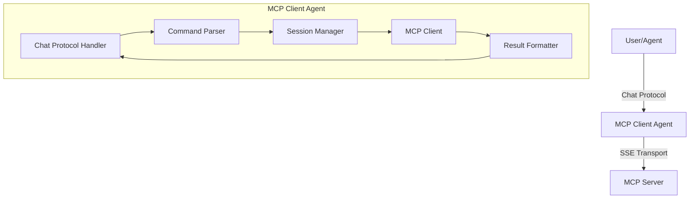

# Software Developer MCP Client Agent

[](.)
[](https://www.python.org/)
[](https://fetch.ai/uagents)
[](https://github.com/fetchai/fastmcp)
[](.)
[](./software_developer/)

## Overview

The **Software Developer MCP Client Agent** is a uAgents-based tool within Fetch.ai's ecosystem, designed to connect to **Model Context Protocol (MCP)** servers via **Server-Sent Events (SSE)** transport. It provides a chat interface for seamless interaction with the **Software Developer Team MCP server**, acting as a **Full Stack Developer**, **Product Designer**, and **Technical Documentation Writer**. With expertise in **React**, **Next.js**, **Tailwind CSS**, **Express.js**, **JavaScript**, and **Node.js**, the agent supports building scalable, user-friendly software solutions.

The agent supports both **natural language** and **structured commands**, enabling developers to connect to MCP servers, discover tools, and execute tasks efficiently. It integrates with tools like **Flowise** (for agent creation) and **Activepieces** (for workflow automation), making it a powerful addition to Fetch.ai's Agentverse.

## Key Features

- **Seamless MCP Server Connection**: Connects to MCP servers using SSE transport for real-time communication.
- **Flexible Chat Interface**: Supports natural language (e.g., `connect to MCP server`) and structured commands (e.g., `!connect`).
- **Multi-Role Capabilities**: Combines development, design, and documentation skills in one agent.
- **Robust Connection Management**: Maintains state between messages for uninterrupted interactions.
- **Parameter Validation**: Automatically validates and auto-fills tool parameters to reduce errors.
- **Schema Support**: Provides detailed tool schema information for precise command usage.
- **Authentication Support**: Handles tokens for secure MCP server connections.

## Installation

1. **Clone the Repository**:
   ```bash
   git clone https://github.com/gautammanak1/mcp
   cd software_developer
   ```

2. **Install Dependencies**:
   Ensure Python 3.8+ is installed, then run:
   ```bash
   pip install -r requirements.txt
   ```

   Dependencies include:
   ```
   uagents>=0.6.0
   uagents-core>=0.2.0
   fastmcp>=0.1.0
   pydantic>=2.0.0
   aiohttp>=3.8.5
   python-dotenv>=1.0.0
   ```

3. **Run the Agent**:
   ```bash
   python run_agent.py
   ```

   The agent will start on port `8000` and log its unique address to the console. Note this address for interacting with the agent (e.g., `agent1q2y0zjkqa9h2ywrm3dazpnvkk538j5upxh3yru8qkmdhhnm4udf6qkxd208`).

## Usage

### Starting the Agent

```python
from software_developer.agent import MCPClientAgent

agent = MCPClientAgent(
    name="Software Developer Agent",
    seed="Software Developer Agent",
    port=8000
)
agent.run()
```

### Supported Commands

The agent supports both **natural language** and **structured commands**. Natural language commands must start with specific phrases (case-insensitive).

#### Natural Language Commands
- `connect to <url>`: Connects to an MCP server (e.g., `connect to https://cloud.activepieces.com/api/v1/mcp/eXn1phtlfMxf26lwjDLHo/sse`).
- `list tools`: Lists available tools on the connected server.
- `call <tool_name> with <params>`: Calls a tool with specified parameters (e.g., `call flow-Software-Developer-Team with {"tool": "build a todo list app"}`).
- `schema <tool_name>`: Displays the schema for a specified tool.
- `disconnect`: Disconnects from the current server.
- `status`: Checks connection status.
- `help`: Shows available commands.

#### Structured Commands
- `!connect <url> [--token TOKEN] [--token-env-var VAR_NAME]`
- `!disconnect`
- `!list`
- `!call <tool_name> <json_args>`
- `!shorthand <tool_name> <arg1=value1> <arg2=value2> ...`
- `!schema <tool_name>`
- `!status`
- `!help`

### Example Workflow

```python
from software_developer.agent import MCPClientAgent

agent = MCPClientAgent()

# Connect to an MCP server
agent.process_message("!connect https://cloud.activepieces.com/api/v1/mcp/eXn1phtlfMxf26lwjDLHo/sse")
# Output: Successfully connected to MCP server

# List available tools
agent.process_message("!list")
# Output: Available tools: flow-Software-Developer-Team

# Call a tool
agent.process_message('!call flow-Software-Developer-Team {"tool": "build a todo list app"}')
# Output: Successfully built to-do list app 'MyTodoApp'. UI designed and documentation generated.

# View tool schema
agent.process_message("!schema flow-Software-Developer-Team")
# Output: Schema details with parameters and example usage

# Disconnect
agent.process_message("!disconnect")
# Output: Disconnected from MCP server
```

### Chat Interface on Agentverse

Interact with the agent via [Agentverse's chat interface](https://chat.agentverse.ai/). Use the agent's address (logged on startup) and send commands like:
- `connect to https://cloud.activepieces.com/api/v1/mcp/eXn1phtlfMxf26lwjDLHo/sse`
- `call flow-Software-Developer-Team {"tool": "build a todo list app"}`

### Example Chat Client

To interact programmatically, use the following chat client example. Save it as `chat_client_example.py` and replace `MCP_CLIENT_AGENT_ADDRESS` with the agent's address.

```python
import asyncio
import logging
from uagents import Agent, Context
from uagents.setup import fund_agent_if_low
from uagents_core.contrib.protocols.chat import chat_proto, ChatMessage, TextContent, ChatAcknowledgement

# Configuration
CLIENT_NAME = "mcp_chat_client"
CLIENT_SEED = "mcp_chat_client_seed"
MCP_CLIENT_AGENT_ADDRESS = "agent1q2y0zjkqa9h2ywrm3dazpnvkk538j5upxh3yru8qkmdhhnm4udf6qkxd208"  # Replace with actual agent address

# Logging
logging.basicConfig(level=logging.INFO)

# Initialize Agent
agent = Agent(
    name=CLIENT_NAME,
    seed=CLIENT_SEED,
    port=8001,
    mailbox=True
)

print(f"Chat Client starting. Address: {agent.address}")
print(f"Sending request to: {MCP_CLIENT_AGENT_ADDRESS}")

@agent.on_event("startup")
async def send_chat_request(ctx: Context):
    """Send a chat message request on startup."""
    command = "connect to https://cloud.activepieces.com/api/v1/mcp/eXn1phtlfMxf26lwjDLHo/sse"
    ctx.logger.info(f"Sending chat request: {command}")
    
    chat_msg = ChatMessage(content=[TextContent(text=command)])
    
    try:
        await ctx.send(MCP_CLIENT_AGENT_ADDRESS, chat_msg)
        ctx.logger.info("Chat request sent successfully.")
    except Exception as e:
        ctx.logger.error(f"Error sending chat request: {e}")

@chat_proto.on_message(ChatMessage)
async def handle_chat_response(ctx: Context, sender: str, msg: ChatMessage):
    """Handle incoming chat messages from the server."""
    ctx.logger.info(f"Received chat message from {sender}:")
    for item in msg.content:
        if isinstance(item, TextContent):
            ctx.logger.info(f"  -> Text: '{item.text}'")
        else:
            ctx.logger.info(f"  -> Received content of type: {type(item)}")
    
    try:
        await ctx.send(sender, ChatAcknowledgement(acknowledged_msg_id=msg.msg_id))
    except Exception as e:
        ctx.logger.error(f"Error sending chat acknowledgement: {e}")

@chat_proto.on_message(ChatAcknowledgement)
async def handle_chat_ack(ctx: Context, sender: str, msg: ChatAcknowledgement):
    """Handle acknowledgements from the server."""
    ctx.logger.info(f"Received chat ACK from {sender} for message {msg.acknowledged_msg_id}")

# Include the protocol
agent.include(chat_proto)

if __name__ == "__main__":
    fund_agent_if_low(agent.wallet.address())
    agent.run()
```

Run the client:
```bash
python chat_client_example.py
```

## Architecture

The agent consists of the following components:

1. **Agent Core**: Initializes the uAgents framework and chat protocol.
2. **Chat Protocol Handler**: Processes incoming chat messages.
3. **Command Parser**: Parses and validates structured commands.
4. **Session Manager**: Manages connection state with MCP servers.
5. **MCP Client**: Wraps the `fastmcp` Client for tool interactions.
6. **Result Formatter**: Formats responses for readability.
7. **Schema Utilities**: Handles schema extraction, validation, and parameter processing.



## Code Overview

### Core Components and How They Work

The MCP Client Agent is built with a modular architecture where each component has specific responsibilities. Here's how the code is organized and how the key functions work:

#### 1. Main Agent Class (`agent.py`)

**Key Function: `MCPClientAgent.__init__()`**

```python
def __init__(self, name: str = "MCP Client Agent", seed: str = "mcp_client_agent_seed", port: int = 8000, mailbox: bool = True):
```

- Initializes the uAgents framework
- Sets up all component instances (session manager, MCP client, command parser, etc.)
- Configures chat protocol integration
- Establishes event handlers for startup/shutdown

**Key Function: `process_message()`**

```python
async def process_message(self, message: str) -> str:
```

- Entry point for programmatic message processing
- Converts string messages to ChatMessage format
- Routes to chat handler for processing
- Returns formatted response text

#### 2. Chat Handler (`chat_handler.py`)

**Key Function: `handle_message()`**

```python
async def handle_message(self, message: ChatMessage) -> str:
```

- **Purpose**: Central message processing hub
- **Process**:
  1. Extracts text content from ChatMessage
  2. Parses command using CommandParser
  3. Routes to appropriate handler method
  4. Returns formatted response

**Key Function: `_execute_command()`**

```python
async def _execute_command(self, command: ParsedCommand) -> str:
```

- **Purpose**: Command execution dispatcher
- **Process**: Routes parsed commands to specific handlers:
  - `_handle_connect()` - MCP server connections
  - `_handle_call_tool()` - Tool execution
  - `_handle_list_tools()` - Tool discovery
  - `_handle_get_schema()` - Schema retrieval

#### 3. Command Parser (`command_parser.py`)

**Key Function: `parse()`**

```python
def parse(self, text: str) -> Optional[ParsedCommand]:
```

- **Purpose**: Converts natural language and structured commands into ParsedCommand objects
- **Process**:
  1. Checks if text starts with "!" (structured command)
  2. If not, tries natural language pattern matching
  3. Extracts action and parameters
  4. Returns ParsedCommand with action, parameters, and raw text

**Key Function: `_parse_natural_language()`**

```python
def _parse_natural_language(self, text: str) -> Optional[ParsedCommand]:
```

- **Purpose**: Handles natural language command parsing
- **Process**: Uses regex patterns to match phrases like "connect to", "list tools", "call"
- **Example**: "connect to https://example.com" → ParsedCommand(action="connect", parameters={"url": "https://example.com"})

#### 4. MCP Client (`mcp_client.py`)

**Key Function: `connect()`**

```python
async def connect(self, url: str, token: Optional[str] = None) -> bool:
```

- **Purpose**: Establishes SSE connection to MCP server
- **Process**:
  1. Creates SSETransport with URL and optional auth headers
  2. Initializes fastmcp Client with transport
  3. Enters client context (`__aenter__`)
  4. Lists available tools from server
  5. Updates connection state

**Key Function: `call_tool()`**

```python
async def call_tool(self, tool_name: str, arguments: Dict[str, Any]) -> Any:
```

- **Purpose**: Executes tools on connected MCP server
- **Process**:
  1. Validates connection state
  2. Finds tool by name in tools list
  3. Validates parameters using ParameterValidator
  4. Calls fastmcp client.call_tool()
  5. Returns execution result

#### 5. Schema Utilities (`schema_utils.py`)

**Key Function: `extract_schema()`**

```python
def extract_schema(self, tool: Any) -> Dict[str, Any]:
```

- **Purpose**: Extracts schema information from tool objects
- **Process**:
  1. Tries multiple attribute names (schema, input_schema, inputSchema)
  2. Handles callable schemas by invoking them
  3. Converts non-dict objects to dictionaries
  4. Validates and normalizes schema structure

**Key Function: `generate_example_parameters()`**

```python
def generate_example_parameters(self, schema: Dict[str, Any]) -> Dict[str, Any]:
```

- **Purpose**: Creates example parameter sets for tool usage
- **Process**:
  1. Extracts required parameters from schema
  2. Generates appropriate example values based on parameter types
  3. Includes optional parameters with default values
  4. Returns complete example parameter dictionary

**Key Function: `validate_and_fill_parameters()`**

```python
async def validate_and_fill_parameters(self, tool: Any, provided_args: Dict[str, Any]) -> Dict[str, Any]:
```

- **Purpose**: Ensures tool calls have correct parameters
- **Process**:
  1. Extracts tool schema using SchemaUtils
  2. Checks for missing required parameters
  3. Auto-fills default values for optional parameters
  4. Performs basic type validation
  5. Returns validated and complete parameter set

**Key Function: `_format_parameter_error()`**

```python
def _format_parameter_error(self, tool: Any, schema: Dict[str, Any], missing_required: List[str]) -> str:
```

- **Purpose**: Creates helpful error messages for parameter issues
- **Process**:
  1. Lists missing required parameters
  2. Shows parameter types and descriptions
  3. Generates example usage with correct format
  4. Returns formatted error message

#### 7. Session Manager (`session_manager.py`)

**Key Function: `create_session()`**

```python
def create_session(self, url: str, token: Optional[str] = None) -> MCPSession:
```

- **Purpose**: Manages MCP server connection sessions
- **Process**:
  1. Creates MCPSession object with connection details
  2. Closes any existing session
  3. Sets new session as current
  4. Maintains session history (last 10 sessions)

**Key Function: `update_session_tools()`**

```python
def update_session_tools(self, tools: list):
```

- **Purpose**: Updates tool list for current session
- **Process**: Stores available tools in session metadata for quick access

#### 8. Result Formatter (`result_formatter.py`)

**Key Function: `format_tool_result()`**

```python
def format_tool_result(self, tool_name: str, result: Any) -> str:
```

- **Purpose**: Converts raw MCP responses into readable chat messages
- **Process**:
  1. Handles different result types (MCP content, dict, string)
  2. Formats with appropriate headers and code blocks
  3. Provides consistent success/error formatting

**Key Function: `format_tool_schema()`**

```python
def format_tool_schema(self, tool_name: str, schema: Dict[str, Any]) -> str:
```

- **Purpose**: Creates comprehensive schema documentation
- **Process**:
  1. Organizes parameters by required/optional
  2. Shows parameter types, descriptions, constraints
  3. Generates usage examples
  4. Includes raw schema for advanced users
```

```
## Parameter Validation and Schema Support

The agent includes intelligent parameter handling:
- **Schema-based Validation**: Validates parameters against the tool’s schema.
- **Auto-filling**: Automatically fills optional parameters with default values.
- **Detailed Error Messages**: Provides guidance on missing or incorrect parameters.

Example error output:
```plaintext
❌ Parameter validation error for tool 'flow-Software-Developer-Team':
Missing required parameters: tool

Required parameters:
- `tool`: string - The task to perform

Example usage:
call flow-Software-Developer-Team {
  "tool": "build a todo list app"
}
```

The `!schema` command provides detailed tool schema information, including:
- Parameter details (types, required/optional, descriptions).
- Default values and constraints.
- Example usage and raw schema.

Example schema output:
```plaintext
📝 Schema for tool 'flow-Software-Developer-Team':

**Parameters**:
- `tool` (required): `string` - The task to perform
- `project_name` (optional): `string` - Name of the project
  Default: ""

**Example Usage**:
call flow-Software-Developer-Team {
  "tool": "build a todo list app",
  "project_name": "MyTodoApp"
}
```

## File Structure

```
software_developer/
├── README.md                  # Usage documentation
├── requirements.txt           # Dependencies
├── agent.py                   # Main agent entry point
├── chat_handler.py            # Chat protocol handler
├── command_parser.py          # Command parsing logic
├── session_manager.py         # MCP session management
├── mcp_client.py              # MCP client wrapper
├── result_formatter.py        # Result formatting utilities
├── run_agent.py               # Script to run the agent
```

## Example: Building a Chatbot

The agent can build a JavaScript-based chatbot, design its UI, and generate documentation. Example command and response:

**Command**:
```plaintext
call flow-Software-Developer-Team {"tool": "Build chatbot in JS"}
```

**Response** (abridged):
```plaintext
[
  "✅ Successfully executed flow Software Developer Team

```json
{
  "status": 200,
  "body": {
    "response": {
      "status": 200,
      "headers": {
        "date": "Fri, 23 May 2025 17:55:13 GMT",
        "content-type": "application/json; charset=utf-8",
        "content-length": "12361",
        "connection": "close",
        "vary": "Origin",
        "access-control-allow-credentials": "true",
        "etag": "W/\"3049-BQ8ak/NtW3rvB+cmQhNrIJtKy0w\"",
        "set-cookie": "AWSALBAPP-0=_remove_; Expires=Fri, 30 May 2025 17:55:13 GMT; Path=/, AWSALBAPP-1=_remove_; Expires=Fri, 30 May 2025 17:55:13 GMT; Path=/, AWSALBAPP-2=_remove_; Expires=Fri, 30 May 2025 17:55:13 GMT; Path=/, AWSALBAPP-3=_remove_; Expires=Fri, 30 May 2025 17:55:13 GMT; Path=/"
      },
      "body": {
        "text": "# Simple Chatbot User Manual\n\nWelcome to the Simple Chatbot User Manual. This guide will help you understand how to set up and use the basic JavaScript chatbot application. This chatbot is designed to provide simple interactions and responses based on user input.\n\n## Table of Contents\n\n1. [Introduction](#introduction)\n2. [System Requirements](#system-requirements)\n3. [Installation](#installation)\n4. [Usage](#usage)\n5. [Customization](#customization)\n6. [Troubleshooting](#troubleshooting)\n7. [FAQs](#faqs)\n\n## Introduction\n\nThe Simple Chatbot is a basic web-based application that allows users to interact with a bot through a chat interface. The bot provides predefined responses based on specific keywords detected in the user's input.\n\n## System Requirements\n\nTo run the Simple Chatbot, you need the following:\n\n- A modern web browser (e.g., Google Chrome, Mozilla Firefox, Safari, Microsoft Edge)\n- Basic knowledge of HTML, CSS, and JavaScript (optional for customization)\n\n## Installation\n\n1. **Download the Files**: Ensure you have the following files in the same directory:\n   - `index.html`\n   - `styles.css`\n   - `script.js`\n\n2. **File Structure**: Your project directory should look like this:\n   ```\n   /simple-chatbot\n   ├── index.html\n   ├── styles.css\n   └── script.js\n   ```\n\n3. **Open the Application**: Open the `index.html` file in your web browser to launch the chatbot.\n\n## Usage\n\n1. **Launching the Chatbot**: Open the `index.html` file in your preferred web browser.\n\n2. **Interacting with the Chatbot**:\n   - Type your message in the input field at the bottom of the chat interface.\n   - Press the \"Send\" button or hit the \"Enter\" key to submit your message.\n   - The chatbot will respond based on the keywords in your message.\n\n3. **Example Interactions**:\n   - User: \"Hello\"\n     - Bot: \"Hello! How can I assist you today?\"\n   - User: \"How are you?\"\n     - Bot: \"I'm just a bot, but I'm here to help!\"\n\n## Customization\n\nTo customize the chatbot's responses or appearance, follow these steps:\n\n1. **Modify Responses**:\n   - Open `script.js`.\n   - Edit the `generateResponse` function to add or change keyword-based responses.\n\n2. **Change Appearance**:\n   - Open `styles.css`.\n   - Modify the CSS properties to change the look and feel of the chat interface.\n\n## Troubleshooting\n\n- **No Response from Bot**: Ensure that the `script.js` file is correctly linked in the `index.html` file.\n- **Styling Issues**: Verify that the `styles.css` file is correctly linked in the `index.html` file.\n\n## FAQs\n\n**Q: Can I add more complex responses?**\nA: Yes, you can integrate third-party NLP services or libraries for more advanced interactions.\n\n**Q: How do I deploy this chatbot online?**\nA: You can host the files on any web server or use platforms like GitHub Pages for static site hosting.\n\n**Q: Can I use this chatbot on mobile devices?**\nA: Yes, the chatbot is designed to be responsive and should work on most modern mobile browsers.\n\nFor further assistance, please contact the support team or refer to additional resources on web development and chatbot integration.",
        "question": "Build chatbot in JS .",
        "chatId": "cf98600c-553e-4466-9b82-dc7ef77bed0b",
        "chatMessageId": "4ab94f90-1f59-4001-b512-ddcde7c59e38",
        "sessionId": "cf98600c-553e-4466-9b82-dc7ef77bed0b",
        "agentReasoning": [
          {
            "agentName": "Supervisor",
            "messages": [],
            "next": "developer",
            "instructions": "Create the basic structure and functionality of a chatbot using JavaScript. Focus on setting up the environment, creating a simple interface, and implementing basic interaction logic.",
            "usedTools": [],
            "sourceDocuments": [],
            "artifacts": [],
            "state": {
              "next": "developer",
              "instructions": "Create the basic structure and functionality of a chatbot using JavaScript. Focus on setting up the environment, creating a simple interface, and implementing basic interaction logic.",
              "team_members": "product_designer, developer, technical_writer"
            },
            "nodeId": ""
          },
          {
            "agentName": "Developer",
            "messages": [
              "To build a simple chatbot in JavaScript, you can create a basic web page with an input field for user messages and a display area for the chatbot's responses. Here's a simple example using plain JavaScript, HTML, and CSS:\n\n### HTML\nCreate an `index.html` file:\n\n```html\n<!DOCTYPE html>\n<html lang=\"en\">\n<head>\n    <meta charset=\"UTF-8\">\n    <meta name=\"viewport\" content=\"width=device-width, initial-scale=1.0\">\n    <title>Simple Chatbot</title>\n    <link rel=\"stylesheet\" href=\"styles.css\">\n</head>\n<body>\n    <div id=\"chat-container\">\n        <div id=\"chat-box\"></div>\n        <input type=\"text\" id=\"user-input\" placeholder=\"Type a message...\" />\n        <button id=\"send-btn\">Send</button>\n    </div>\n    <script src=\"script.js\"></script>\n</body>\n</html>\n```\n\n### CSS\nCreate a `styles.css` file for basic styling:\n\n```css\nbody {\n    font-family: Arial, sans-serif;\n    display: flex;\n    justify-content: center;\n    align-items: center;\n    height: 100vh;\n    margin: 0;\n    background-color: #f4f4f9;\n}\n\n#chat-container {\n    width: 300px;\n    border: 1px solid #ccc;\n    border-radius: 5px;\n    overflow: hidden;\n    box-shadow: 0 0 10px rgba(0, 0, 0, 0.1);\n}\n\n#chat-box {\n    height: 400px;\n    overflow-y: auto;\n    padding: 10px;\n    background-color: #fff;\n}\n\n#user-input {\n    width: calc(100% - 60px);\n    padding: 10px;\n    border: none;\n    border-top: 1px solid #ccc;\n    outline: none;\n}\n\n#send-btn {\n    width: 60px;\n    padding: 10px;\n    border: none;\n    background-color: #007bff;\n    color: #fff;\n    cursor: pointer;\n    border-top: 1px solid #ccc;\n}\n\n#send-btn:hover {\n    background-color: #0056b3;\n}\n```\n\n### JavaScript\nCreate a `script.js` file to handle the chatbot logic:\n\n```javascript\ndocument.getElementById('send-btn').addEventListener('click', sendMessage);\ndocument.getElementById('user-input').addEventListener('keypress', function (e) {\n    if (e.key === 'Enter') {\n        sendMessage();\n    }\n});\n\nfunction sendMessage() {\n    const userInput = document.getElementById('user-input');\n    const message = userInput.value.trim();\n    if (message) {\n        appendMessage('User', message);\n        userInput.value = '';\n        generateResponse(message);\n    }\n}\n\nfunction appendMessage(sender, message) {\n    const chatBox = document.getElementById('chat-box');\n    const messageElement = document.createElement('div');\n    messageElement.classList.add('message');\n    messageElement.innerHTML = `<strong>${sender}:</strong> ${message}`;\n    chatBox.appendChild(messageElement);\n    chatBox.scrollTop = chatBox.scrollHeight;\n}\n\nfunction generateResponse(message) {\n    let response = \"I'm not sure how to respond to that.\";\n    if (message.toLowerCase().includes('hello')) {\n        response = 'Hello! How can I assist you today?';\n    } else if (message.toLowerCase().includes('how are you')) {\n        response = \"I'm just a bot, but I'm here to help!\";\n    }\n    setTimeout(() => appendMessage('Bot', response), 500);\n}\n```\n\n### Explanation\n- **HTML**: Sets up the basic structure with a chat container, input field, and send button.\n- **CSS**: Provides basic styling for the chat interface.\n- **JavaScript**: Handles user input, appends messages to the chat box, and generates simple responses based on keywords.\n\nThis is a very basic implementation. For a more advanced chatbot, you might want to integrate with a natural language processing (NLP) service or use a library like `Botpress` or `Dialogflow`."
            ],
            "usedTools": [
              null
            ],
            "sourceDocuments": [
              null
            ],
            "artifacts": [
              null
            ],
            "state": {},
            "nodeId": "worker_1"
          },
          {
            "agentName": "Supervisor",
            "messages": [],
            "next": "technical_writer",
            "instructions": "Document the provided JavaScript chatbot implementation, explaining how each part of the code works and how users can set it up and run it on their own systems. Include any necessary setup instructions and potential extensions or customizations.",
            "usedTools": [],
            "sourceDocuments": [],
            "artifacts": [],
            "state": {
              "next": "technical_writer",
              "instructions": "Document the provided JavaScript chatbot implementation, explaining how each part of the code works and how users can set it up and run it on their own systems. Include any necessary setup instructions and potential extensions or customizations.",
              "team_members": "product_designer, developer, technical_writer"
            },
            "nodeId": ""
          },
          {
            "agentName": "Technical Writer",
            "messages": [
              "# Simple Chatbot User Manual\n\nWelcome to the Simple Chatbot User Manual. This guide will help you understand how to set up and use the basic JavaScript chatbot application. This chatbot is designed to provide simple interactions and responses based on user input.\n\n## Table of Contents\n\n1. [Introduction](#introduction)\n2. [System Requirements](#system-requirements)\n3. [Installation](#installation)\n4. [Usage](#usage)\n5. [Customization](#customization)\n6. [Troubleshooting](#troubleshooting)\n7. [FAQs](#faqs)\n\n## Introduction\n\nThe Simple Chatbot is a basic web-based application that allows users to interact with a bot through a chat interface. The bot provides predefined responses based on specific keywords detected in the user's input.\n\n## System Requirements\n\nTo run the Simple Chatbot, you need the following:\n\n- A modern web browser (e.g., Google Chrome, Mozilla Firefox, Safari, Microsoft Edge)\n- Basic knowledge of HTML, CSS, and JavaScript (optional for customization)\n\n## Installation\n\n1. **Download the Files**: Ensure you have the following files in the same directory:\n   - `index.html`\n   - `styles.css`\n   - `script.js`\n\n2. **File Structure**: Your project directory should look like this:\n   ```\n   /simple-chatbot\n   ├── index.html\n   ├── styles.css\n   └── script.js\n   ```\n\n3. **Open the Application**: Open the `index.html` file in your web browser to launch the chatbot.\n\n## Usage\n\n1. **Launching the Chatbot**: Open the `index.html` file in your preferred web browser.\n\n2. **Interacting with the Chatbot**:\n   - Type your message in the input field at the bottom of the chat interface.\n   - Press the \"Send\" button or hit the \"Enter\" key to submit your message.\n   - The chatbot will respond based on the keywords in your message.\n\n3. **Example Interactions**:\n   - User: \"Hello\"\n     - Bot: \"Hello! How can I assist you today?\"\n   - User: \"How are you?\"\n     - Bot: \"I'm just a bot, but I'm here to help!\"\n\n## Customization\n\nTo customize the chatbot's responses or appearance, follow these steps:\n\n1. **Modify Responses**:\n   - Open `script.js`.\n   - Edit the `generateResponse` function to add or change keyword-based responses.\n\n2. **Change Appearance**:\n   - Open `styles.css`.\n   - Modify the CSS properties to change the look and feel of the chat interface.\n\n## Troubleshooting\n\n- **No Response from Bot**: Ensure that the `script.js` file is correctly linked in the `index.html` file.\n- **Styling Issues**: Verify that the `styles.css` file is correctly linked in the `index.html` file.\n\n## FAQs\n\n**Q: Can I add more complex responses?**\nA: Yes, you can integrate third-party NLP services or libraries for more advanced interactions.\n\n**Q: How do I deploy this chatbot online?**\nA: You can host the files on any web server or use platforms like GitHub Pages for static site hosting.\n\n**Q: Can I use this chatbot on mobile devices?**\nA: Yes, the chatbot is designed to be responsive and should work on most modern mobile browsers.\n\nFor further assistance, please contact the support team or refer to additional resources on web development and chatbot integration."
            ],
            "usedTools": [
              null
            ],
            "sourceDocuments": [
              null
            ],
            "artifacts": [
              null
            ],
            "state": {},
            "nodeId": "worker_2"
          },
          {
            "agentName": "Supervisor",
            "messages": [],
            "next": "FINISH",
            "instructions": "The task of building a simple chatbot in JavaScript and documenting it is complete. No further action is required.",
            "usedTools": [],
            "sourceDocuments": [],
            "artifacts": [],
            "state": {
              "next": "FINISH",
              "instructions": "The task of building a simple chatbot in JavaScript and documenting it is complete. No further action is required.",
              "team_members": "product_designer, developer, technical_writer"
            },
            "nodeId": ""
          }
        ]
      }
    }
  },
  "headers": {
    "x-webhook-id": "GgNJexizfD5mQPpOfwzIs"
  }
}
```"
]
```

The response includes HTML, CSS, and JavaScript code for a chatbot, along with a detailed user manual (see blog post for full details).

## Integration with Flowise and Activepieces

- **Flowise**: Use Flowise to build the Software Developer Team Agent with roles for development, design, and documentation. Configure skills in React, Next.js, Tailwind CSS, etc.
  - Create a new agent in Flowise.
  - Assign roles: Full Stack Developer, Product Designer, Technical Documentation Writer.
  - Generate an API endpoint (e.g., `https://cloud.flowiseai.com/api/v1/prediction/chat-flow-id`).

- **Activepieces**: Set up workflows to connect the Flowise agent to the MCP server via SSE.
  - Log in to [Activepieces](https://cloud.activepieces.com).
  - Create a workflow named "Connect Flowise to MCP Server."
  - Add a trigger with the Flowise API endpoint and body: `{"question": "{{trigger.tool}}"}`.
  - Obtain the SSE link (e.g., `https://cloud.activepieces.com/api/v1/mcp/eXn1phtlfMxf26lwjDLHo/sse`).

## Testing on Agentverse

Test the agent on [Agentverse](https://agentverse.ai/) by connecting to the MCP server using the SSE link and sending commands via [chat.agentverse.ai](https://chat.agentverse.ai/). Example agent profile: [Agent Profile](https://agentverse.ai/agents/details/agent1q2y0zjkqa9h2ywrm3dazpnvkk538j5upxh3yru8qkmdhhnm4udf6qkxd208/profile).

## Troubleshooting

- **Connection Failure**:
  - **Cause**: Incorrect SSE link or inactive Activepieces workflow.
  - **Solution**: Verify the SSE link and ensure the Activepieces workflow and Flowise API are accessible.
- **Tool Call Failure**:
  - **Cause**: Missing required parameters.
  - **Solution**: Use `!schema <tool_name>` to check required parameters. Ensure JSON arguments are correctly formatted.
  - Example:
    ```python
    agent.process_message("!schema flow-Software-Developer-Team")
    # Output: Schema: {"tool": {"type": "string", "required": true}, "project_name": {"type": "string", "required": false}}
    ```
- **Agent Not Responding**:
  - **Cause**: Agent not running or port conflict.
  - **Solution**: Ensure the agent is running (`python run_agent.py`). Check for port conflicts on `8000` or `8001` and change if needed (e.g., `port=8002`).
- **Flowise/Activepieces Connection Failure**:
  - **Cause**: Incorrect API key or base URL.
  - **Solution**: Verify the Flowise API key and base URL in Activepieces.

## License

[MIT License](LICENSE)

## Resources

- [Fetch.ai](https://fetch.ai/) | [Docs](https://fetch.ai/docs)
- [uAgents](https://uagents.fetch.ai/docs)
- [Agentverse](https://agentverse.ai/) | [Chat](https://chat.agentverse.ai/) | [Docs](https://docs.agentverse.ai/docs)
- [Flowise](https://flowiseai.com/)
- [Activepieces](https://www.activepieces.com/)
- [Innovation Lab](https://innovationlab.fetch.ai/) | [Docs](https://innovationlab.fetch.ai/resources/docs/intro)
- [Gautam Manak](https://gautammanak.vercel.app/)

## Contributing

Join the Fetch.ai developer community to share feedback and contribute. Clone the repository, make improvements, and submit a pull request!

---

*Author: Gautam Kumar, Developer Advocate at Fetch AI*
  